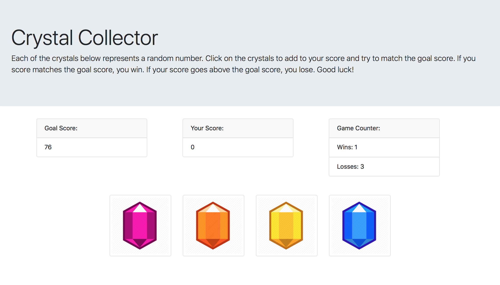

# Crystal Collector Game

### About This Project
This project uses HTML, Bootstrap, and Javascript to create a crystal collector game. The basis of the game is that the computer generates a random number, each crystal represents a random number, and the user must click on the crystals to try to get their score to match the goal score.

If the user's score matches the goal score:
* The user wins
* Their win count increases by 1
* The game resets so they can play again

If the user's score goes above the goal score:
* The user loses
* Their losses count increases by 1
* The game resets so they can play again

### To Start Playing
Go to [this page](https://carmcollins.github.io/crystal-collector/) and press any crystal to begin playing!

